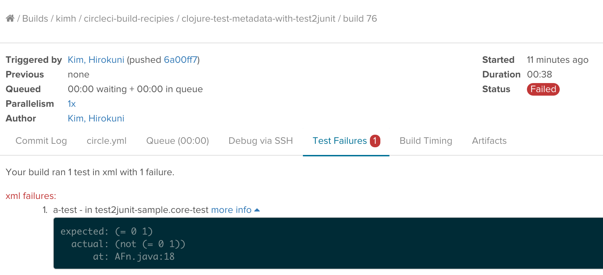

# Test metada collection for Clojure with test2junit

By using [test2junit](https://github.com/ruedigergad/test2junit) you can collect test metadata for your Clojure tests and display test results nicely in a build page. Here is how it looks like.



# How to collect metadata
There are two things you need to do.

### Add test2junit to project.clj

You need to add test2junit to lein plugins and `:test2junit-output-dir` in your project.clj. CIRCLE_TEST_REPORTS is an env var which is automatically set by CirclCI at build time.

```
(defproject test2junit_sample "0.1.0-SNAPSHOT"
  :description "FIXME: write description"
  :url "http://example.com/FIXME"
  :license {:name "Eclipse Public License"
            :url "http://www.eclipse.org/legal/epl-v10.html"}
  :dependencies [[org.clojure/clojure "1.6.0"]]
  :plugins [[test2junit "1.1.2"]]
  :test2junit-output-dir ~(or (System/getenv "CIRCLE_TEST_REPORTS") "target/test2junit")
  :main test2junit-sample.core)
```

### lein test2junit
By default, CircleCI will infer and run `lein test` for Clojure test. You need to override the inference in your circle.yml.

```
test:
  override:
    - lein test2junit
```

That's all you have to do!!

